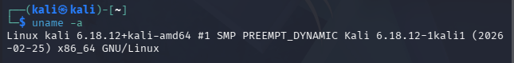
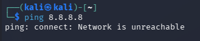
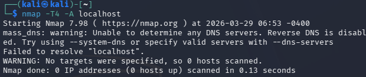
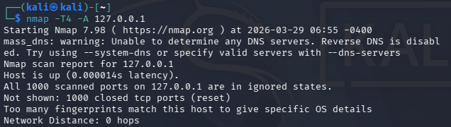
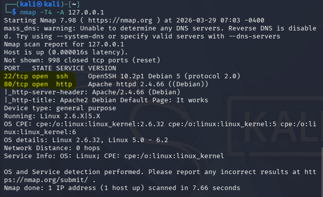
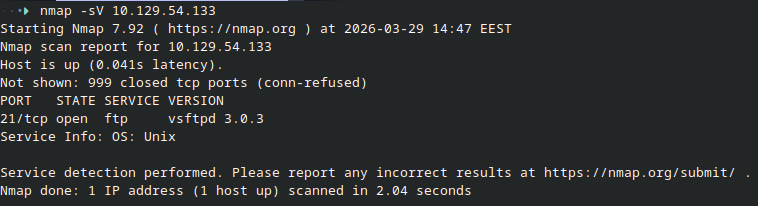
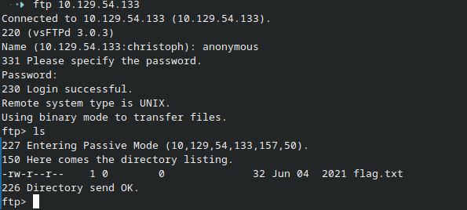
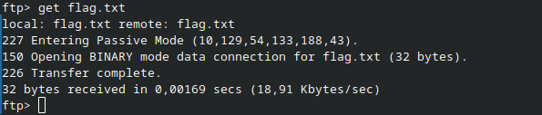

# h1 Kybertappoketju

### X) Tiivistelmät
[Darknet Diaries Ep. 159 - Vastaamo](https://darknetdiaries.com/episode/159/)

- Joe Tidy kuvailee suomessa tapahtunutta Vastaamon tietomurtoa yhdeksi historian julmimmista
- Hyökkääjä nimeltä ransom man (Julius Kivimäki) vaati vastaamolta 400 000€ lunnaita kiristyksenä
- Kun Vastaamo kieltäytyi maksamasta, alkoi Julius Kivimäki julkaisemaan potilaskertomuksia
- Hän julkaisi teitoisesti arkaluontoista dataa maksimoidakseen uhrien kärsimyksen
- Hän myös lähestyi itse uhreja kiristysviesteillä
- Hakkeri mokasi ja pakkasi vahingossa koko kotihakemistonsa tarballiin, josta myöhemmin löytyi suomalaiseen pilvipalveluntarjoajaan yhdistetty IP-osoite
- Palvelin irrotettiin fyysisesti verkosta, ennen kuin hakkeri ehti puhdistaa jälkensä
- Palvelin oli täynnä tietoja hyökkääjästä
- Seuraukset olivat järkyttäviä: jotkut uhrit päätyivät jopa itsemurhaan tietomurron aiheuttaman häpeän jälkeen

[Hutchins et al 2011: Intelligence-Driven Computer Network Defense Informed by Analysis of Adversary Campaigns and Intrusion Kill Chains, chapters Abstract, 3.2 Intrusion Kill Chain.](https://lockheedmartin.com/content/dam/lockheed-martin/rms/documents/cyber/LM-White-Paper-Intel-Driven-Defense.pdf)


 Hyökkäys perustuu seitsemästä vaiheesta
  1. Tiedustelu (recon), eli kohteen tutkiminen ja valinta
  2. Aseistaminen (Weaponization), eli hyökkäyksen valmistelu
  3. Toimitus (Delivery) hyökkäystyökalun siirtäminen hyökättävälle palvelimelle
  4. Hyödyntäminen (Exploitation) laitetaan uhri ajamaan koodi
  5. Asennus (Install) etähallintatyökalun tai takaportin asennus
  6. Etähallinta (Command and control) saastunut palvelin ottaa yhteyden takaisin hyökkääjän koneeseen
  7. Toiminta tavoitteiden saavuttamiseksi (Actions on objectives) varsinaiset tavoitteet suoritetaan(esim. tiedonkeräys, ransomware jne.)

[The Art of Hacking: 4.3 Surveying Essential Tools for Active Reconnaissance](https://learning.oreilly.com/videos/the-art-of/9780135767849/9780135767849-SPTT_04_00/)

Aktiivinen tiedustelu

- Porttiskannaus (nmap, masscan,uddpprotoscanner)
- Web Service Review (ohjelmat kuten eyewitness voi kartoittaa verkkoja ottamalla niistä kuvia. Auttaa heti hahmottamaan korkea-arvoiset kohteet johon hyökätä)
- Network Vulnerability Scanners (kuten OpenVAS tunnistaa järjestelmistä reikiä, heikkouksia ja vanhentuneita ohjelmistoja jota käyttää hyökkäyksessä)
- Web Vulnerability Scanners (kuten Burp suite, testaa lomakkeita ja syötteitä, SQL injektio, JS hyväksikäyttö)


### a) Kalin asennus virtuaalikoneeseen


Käytin kalin asennukseen Virtual Machine Manageria (virt-manager) Linuxilla.





### b) Testaus etttä kone ei ole verkossa
Irrotin virtuaalikoneen verkosta ja testasin, ettei kone saa yhteyttä ulkoverkkoon





### c) Porttiskannaus
Porttiskannasin ensin komennolla
```nmap -T4 -A localhost```
mutta koska nmap yrittää ottaa yhteyttä nimipalvelimeen, niin koko juttu epäonnistuu (olen irti verkosta)



Koitin uudelleen käyttäen localhost IP-osoitetta 127.0.0.1



Skannauksen tulos oli että mikään portti ei ole auki.

### d) Porttiskannaus SSH ja Apachen ollessa käynnissä
Käynnistin SSH demonin jaApachen ja ajoin porttiskannauksen uudelleen.



Nyt skannauksessa näkyy kaksi aukinaista porttia, 22 SSH yhteydelle ja 80 HTTP yhteydelle.

### e) HTB koneen ratkaisu

Valitsin koneeksi "Fawn". Skannasin aukinaisia portteja nmap:in avulla ja huomasin että ftp portti on auki. 



kirjauduin ftp:hen sisään anonymous käyttäjällä ja jätin salasanan tyhjäksi. Tämän jälkeen listasin tiedostot ja näin tarvitsevani "flag.txt" tiedoston.



käytin komentoa get flag.txt ja latasin tiedoston.


