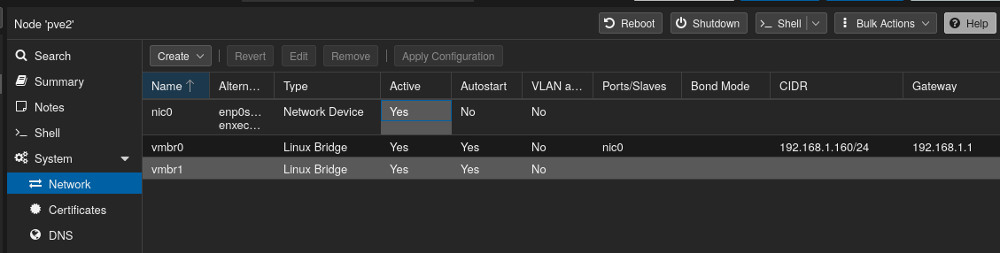
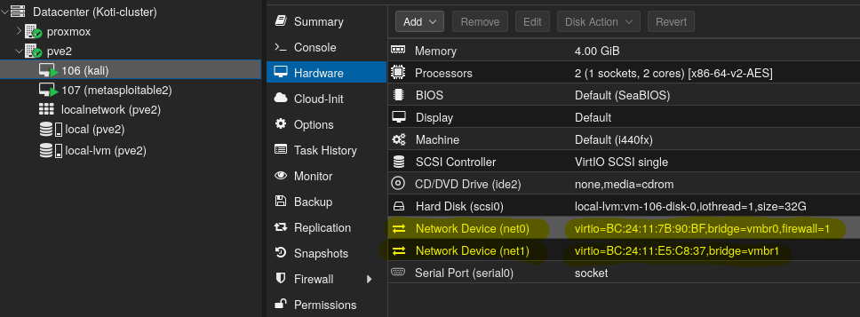
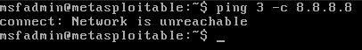
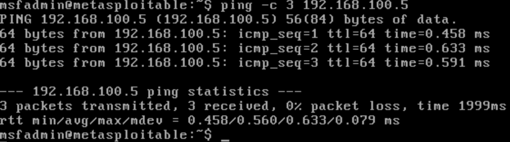
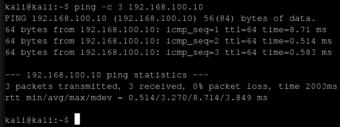
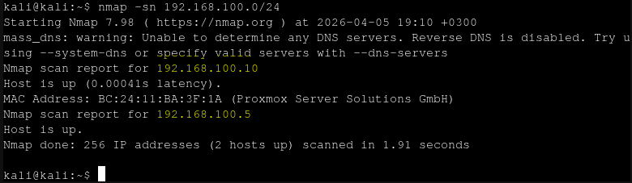
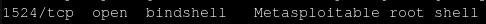
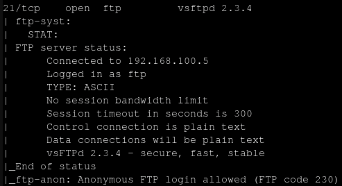
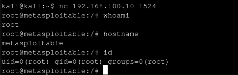

# h2 DORA the Explora
## x) Tiivistelmät

### [Buuri 2026: DORA and TLPT testing - Lecture for Haaga-Helia on 31 March 2026](https://terokarvinen.com/buuri-2026-dora-and-threat-lead-penetration-testing/buuri-2026-dora-and-threat-lead-penetration-testing--teros-pentest-course.pdf)
- DORA (Digital Operational Resilience Act): EU-asetus, joka velvoittaa finanssialan yrityksiä ja niiden yhteistyökumppaneita varmistamaan digitaalisen häiriönsietokykynsä

- Kaikkien tarvitsee käydä testausta ja isot yritykset käyvät myös TLTP (Threat-Led Penetration Testing) testausta

- TIBER-FI: kehikko ja toimintamalli DORA mukaisten TLPT-testien toteuttamiseen Suomessa

- Testaus on monivaiheinen ja pitkä (kokonaiskesto jopa 18kk)

- Testeissä käydään todellisia hyökkäyskenaarioita

### [DORA (Regulation ... on digital operational resilience for the financial sector)](https://eur-lex.europa.eu/eli/reg/2022/2554/oj/eng)

Artikla 26 koskee syventävää testausta (TLPT)
- Viranomaiset määrää yritykset joiden on tehtävä testi
- Suoritettava vähintään 3v välein
- Testit käydään tuotantojärjesteömissä livenä
- Testeistä toimitetaan yhteenveto viranomaiselle joka antaa suorituksesta todistuksen

Artikla 27 koskee vaatimuksia
- Testaajilta vaaditaan paljon ennakkotietoa ja kokemusta
- Sertifikaatit kunnossa
- Pankki saa käyttää omia testaajia vain jos viranomainen antaa levykuvakkeen
- Vähintään joka kolmas testi pitää olla ulkopuolisilta tesaajilta


### [TIBER-FI procedures and guidelines](https://www.suomenpankki.fi/globalassets/bof/en/money-and-payments/the-bank-of-finland-as-catalyst-payments-council/tiber-fi/tiber-fi-2.0-procedures-and-guidelines.pdf)


- RTTP (Red Team Test Plan), testisuunnitelman luominen uhkien pohjalta
- Aktiviinen testaus eli itse hyökkäysvaihe jossa yritetään suorittaa tavoitteet

- Cyber Kill chain: tiedonkeruu, aseistaminen, toimitus, murtautuminen, etähallitna, sisäinen liikkuminen, toiminnot kohteessa
- Leg up: pieni apu testaajille, jos he esim jäävät jumiin johonkin vaiheeseen


## a) Asenna Metasploitable 2 virtuaalikoneeseen.

Käytin tähän Proxmox Virtual Environment alustaa hypervisorina, jonne virtuaalikoneet on asennettu.
Metsasploitablea varten piti tehdä uusi tyhjä virtuaalikone ja jättää levykuva tyhjäksi, sillä lataamme 
metasploitin virtuaalilevyn ja liitämme sen koneeseen.

Siirsin ja purin Metasploitin levykuvakkeen proxmox palvelimelle ja siellä ajoin komennon

```
# muodossa: qm importdisk <VM_ID> <Lähdetiedosto> <Tallennustila>
qm importdisk 101 Metasploitable.vmdk local-lvm
```
VM_ID on virtuaalikoneen ID. Tämän jälkeen pitää levy vielä lisätä virtuaalikoneeseen asetuksista ja muuttaa virtio sataksi, jotta levy tunnistetaan oikein.


## b) Virtaaliverkko koneiden välille

Tein uuden linux bridgen nimeltä vmbr1 ja kävin lisäämässä metasploitablen verkkokortin kulkemaan tämän bridgen kautta. Se ei ole kiinni ulkoverkossa ja erillään muista virtuaalikoneista. Kali virtuaalikoneen asetuksista kävin lisäämässä uuden verkkokortin ja liitin vmbr1 siihen. Nyt vmbr1 sisältää kaksi konetta, kali virtuaalikoneen sekä metasploitable virtuaalikoneen. Verkko ei ole yhteydessä ulkoverkkoon, mutta kali linuxissa on kaksi verkkokorttia käytössä, jossa toinen on yhteydessä ulos ja tämän saa aina halutessaan pois päältä.






## c) Virtuaaliverkon testausta
Ping komennolla testasin että koneet eivät saa yhteyttä ulkoverkkoon, mutta pystyvät keskustella toistensa kanssa.






## d) metasploitin skannaaminen ja löytäminen

komennolla 

```
nmap -sn 192.168.100.0/24
```
skannasin verkkoa ja verkosta löytyi kaksi konetta, toinen on kali virtuaalikone (192.168.100.5) ja toinen metasploit (192.168.100.10) 



## e) Porttiskannaus

komennolla

```
nmap -A -T4 -p- 192.168.100.10
```
Skannasin metasploit virtuaalikoneen portteja ja löysin kaksi kiinnostavaa asiaa:
Bindshell on backdoor on aktiivisena, jotenei tarvitse salasanaa vaan bindshell antaa aina korkeimmat root oikeudet



vsftpd, Tämäkin on backdoor, joka on suoraan ohjelmakoodissa, sillä tässä käytettiin hyväksi supply chain attackia ja saastutettiin monta konetta.




## f) *Hacker voice* I'm In

Testataan toimiiko backdoor oikeasti. Valitsen tähän tuon bindshellin joka pyörii portilla 1524.
Komennolla
```
nc -nv 192.168.100.10 1524
```

komento yhdistää suoraan root käyttäjän oikeuksilla palveluun



# Lähteet
* **TIBER-FI procedures and guidelines** – [https://www.suomenpankki.fi/globalassets/bof/en/money-and-payments/the-bank-of-finland-as-catalyst-payments-council/tiber-fi/tiber-fi-2.0-procedures-and-guidelines.pdf](https://www.suomenpankki.fi/globalassets/bof/en/money-and-payments/the-bank-of-finland-as-catalyst-payments-council/tiber-fi/tiber-fi-2.0-procedures-and-guidelines.pdf)
* **DORA (Regulation on digital operational resilience for the financial sector)** – [https://eur-lex.europa.eu/eli/reg/2022/2554/oj/eng](https://eur-lex.europa.eu/eli/reg/2022/2554/oj/eng)
* **Buuri 2026: DORA and TLPT testing - Lecture for Haaga-Helia on 31 March 2026** – [https://terokarvinen.com/buuri-2026-dora-and-threat-lead-penetration-testing/buuri-2026-dora-and-threat-lead-penetration-testing--teros-pentest-course.pdf](https://terokarvinen.com/buuri-2026-dora-and-threat-lead-penetration-testing/buuri-2026-dora-and-threat-lead-penetration-testing--teros-pentest-course.pdf)
* **Metasploitable 2 Exploitability Guide** – [https://docs.rapid7.com/metasploit/metasploitable-2/](https://docs.rapid7.com/metasploit/metasploitable-2/)
* **Proxmox VE: QEMU/KVM Virtual Machines** – [https://pve.proxmox.com/pve-docs/chapter-qm.html](https://pve.proxmox.com/pve-docs/chapter-qm.html)
* **Proxmox VE: Network Configuration** – [https://pve.proxmox.com/wiki/Network_Configuration](https://pve.proxmox.com/wiki/Network_Configuration)
* **VSFTPD v2.3.4 Backdoor Command Execution** – [https://www.rapid7.com/db/modules/exploit/unix/ftp/vsftpd_234_backdoor/](https://www.rapid7.com/db/modules/exploit/unix/ftp/vsftpd_234_backdoor/)


