h4 Täysin Laillinen Sertifikaatti

x) Lue/katso ja tiivistä. (Tässä x-alakohdassa ei tarvitse tehdä testejä tietokoneella, vain lukeminen tai kuunteleminen ja tiivistelmä riittää. Tiivistämiseen riittää muutama ranskalainen viiva kustakin artikkelista - ei pitkiä esseitä. Kannattaa lisätä myös jokin oma ajatus, idea, huomio tai kysymys.)
OWASP 2021: OWASP Top 10:2021
A01:2021 – Broken Access Control (IDOR ja path traversal ovat osa tätä)
PortSwigget Academy:
Insecure direct object references (IDOR)
Path traversal
Cross-site scripting
a) Totally Legit Sertificate. Asenna OWASP ZAP, generoi CA-sertifikaatti ja asenna se selaimeesi. Laita ZAP proxyksi selaimeesi. Laita ZAP sieppaamaan myös kuvat, niitä tarvitaan tämän kerran kotitehtävissä. Osoita, että hakupyynnöt ilmestyvät ZAP:n käyttöliittymään. (Voi vaatia Firefox about:config network.proxy.allow_hijacking_localhost. Foxyproxy laittoi tämän aiemmin päälle itse. Kalin Firefox ESR oli viimeksi ongelmia Foxyproxyn kanssa - vaihtoehtona on asettaa Proxy käsin Settings, hakusana "proxy")
b) Kettumaista. Asenna "FoxyProxy Standard" Firefox Addon, ja lisää ZAP proxyksi siihen. Käytä FoxyProxyn "Patterns" -toimintoa, niin että vain valitsemasi weppisivut ohjataan Proxyyn. (Läksyssä ohjataan varmaankin PortSwigger Labs ja localhost.)
PortSwiggerabs. Ratkaise tehtävät. Selitä ratkaisusi: mitä palvelimella tapahtuu, mitä eri osat tekevät, miten hyökkäys löytyi, mistä vika johtuu. Kannattaa käyttää ZAPia, vaikka malliratkaisut käyttävät harjoitusten tekijän maksullista ohjelmaa. Monet tehtävät voi ratkaista myös pelkällä selaimella. Malliratkaisun kopioiminen ZAP:n tai selaimeen ei ole vastaus tehtävään, vaan ratkaisu ja haavoittuvuuden etsiminen on selitettävä ja perusteltava.
Cross Site Scripting (XSS)
c) Reflected XSS into HTML context with nothing encoded
d) Stored XSS into HTML context with nothing encoded
e) Selitä esimerkin avulla, mitä hyökkääjä hyötyy XSS-hyökkäyksestä. Alert("Hei Tero!") ei vielä tarjoa kummoista pääsyä. (Tässä alakohdassa ei tarvitse tehdä testejä tietokoneella, pelkkä lyhyt ja selkeä selitys riittää.)
Path traversal
f) File path traversal, simple case. Laita tarvittaessa Zapissa kuvien sieppaus päälle.
g) File path traversal, traversal sequences blocked with absolute path bypass
h) File path traversal, traversal sequences stripped non-recursively
Insecure Direct Object Reference (IDOR)
i) Insecure direct object references


a) OWASP ZAP proxyn asennus ja sertifikaatin hankkiminen

Ensiksi asennamme zaproxyn komennolla 

```sudo apt-get update && sudo apt-get install zaproxy```


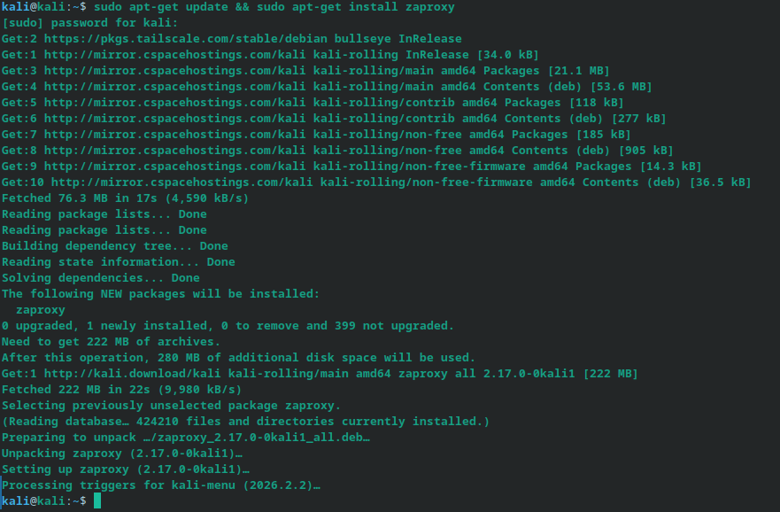

Tämän jälkeen voimme avata Zaproxyn GUI:n kalin työpöpöytänäkymän kautta. Jotta voimme generoida meille tarvittava sertifikaatti, menemme Tools > Options > Network ja valitsemme sieltä Server certificates ja luomme uuden avaimen ja tallennamme sen koneelle. Menemme firefoxiin asentamaan kyseisen setrifikaatin.

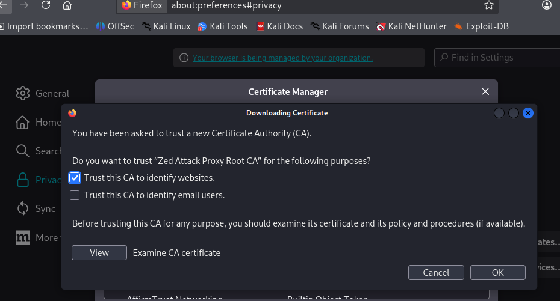

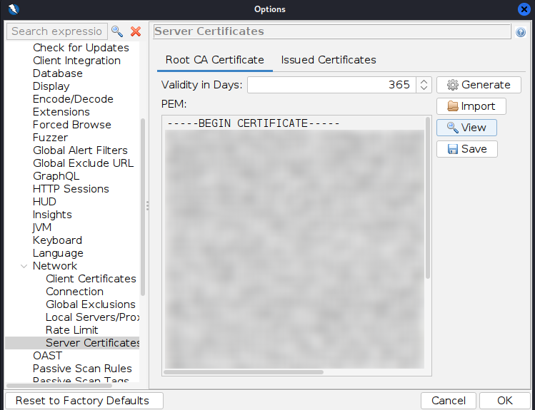

## b) FoxyProxyn asennus

Seuraavaksi menemme Firefoxiin ja asennamme FoxyProxyn firefoxin lisärikaupasta. Kun se on asennettu, menemme sen asetuksiin ja lisäämme uuden proxyn


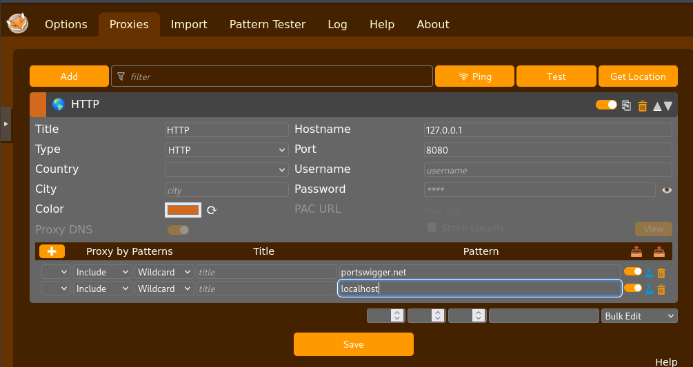


Yritin ensin normaalisti Firefoxin kautta mutta tämä ei päästänyt minua ollenkaan läpi ,vaikka olin tarkastanut että kaikki asetuksien pitäisi olla oikein, joten käytin ZAP:in sisäänrakennettua selainta ja kaikki alkoi toimimaan.


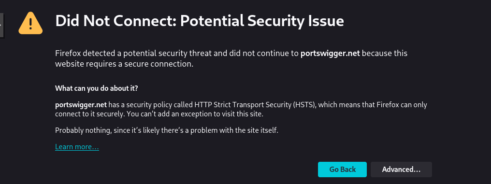

Nyt kaikki liikenne kyllä menee proxyn kautta, mutta jatketaan näin.

## c) Reflected XSS into HTML context with nothing encoded

Meinin ensimmäiseen tehtävään ja syötin hakukenttään koodipätkän ja tarkistin ZAPin historiasta. Se palautui puhdistamattomana läpi, mikä tarkoittaa että syötettä ei puhdisteta ollenkaan, ja voimme syöttää skriptejä haun kautta jotka palvelin suorittaa. Tämä on erittäin huono juttu ja antaa hyökkääjälle keinot ajaa haittaohjelmia palvelimella.


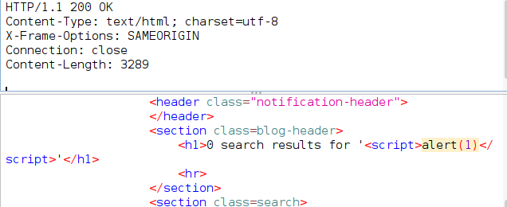


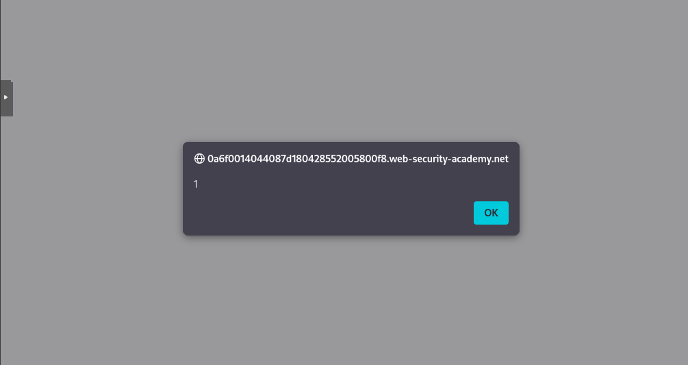

## d) Stored XSS into HTML context with nothing encoded

Tässä tehtävässä ensin jätämme kommentin ja kommenttikenttään laitamme meidän "exploitin".

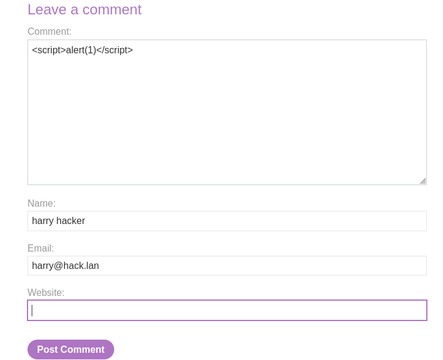

Kun kommentti tallennetaan ja palaamme samalle sivulle, näemmä ZAPissa että henkilö nimeltä harry hacker on injektoinut haittakoodia, joka tallennettiin tietokantaan. Palvelin siis ottaa syötteen vastaan ja tallentaa sen tietokantaan mukisematta. Nyt kun jokainen uusi vierailia käy sivulla, hakee sivu tuon kommentin tietokannasta ja upottaa sen html sivuun. Koska syötettä ei puhdisteta millään tavalla, luulee palvelin kommenttia oikeaksi scriptiksi ja ajaa sen.


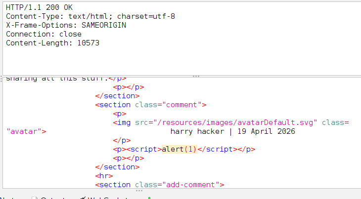

## e) Mitä hyökkääjä hyötyy XSS hyökkäyksestä?

Vaikka tässä käytettiin vaarattomia komentoja, saimme todisteen palvelimen haavoittuvuudesta. Hyökkääjä pystyy ajamaan koodia kenen tahansa uhrin selaimessa. Koodi ajetaan mäkymättömästi taustalla. Hyökkääjä voi esim kaapata istunnon varastamalla evästeet (cookies) ja tekeytyä tämän avulla kyseiseksi henkilöksi ja kirjautua sisään palveluihin ilman käyttäjätunnusta ja salasanaa. Hyökkääjä voi myös suorittaa skriptejä etänä, jotka tekee automaattisesti pyyntöjä urhin koneella. Verkkosivu muuttuu siis periaatteessa hyökkääjän työkaluksi.

## f) File path traversal, simple case

Tässä tehtävässä menemme ensin labraan ja selaamme hetken kuvia jotta ZAPilla olisi jotain jota käyttää hyväksi injektiossa. Tämän jälkeen valitsemme yhden palautuneen kuvan ja avaamme ```manual request editorin``` ZAPissa.

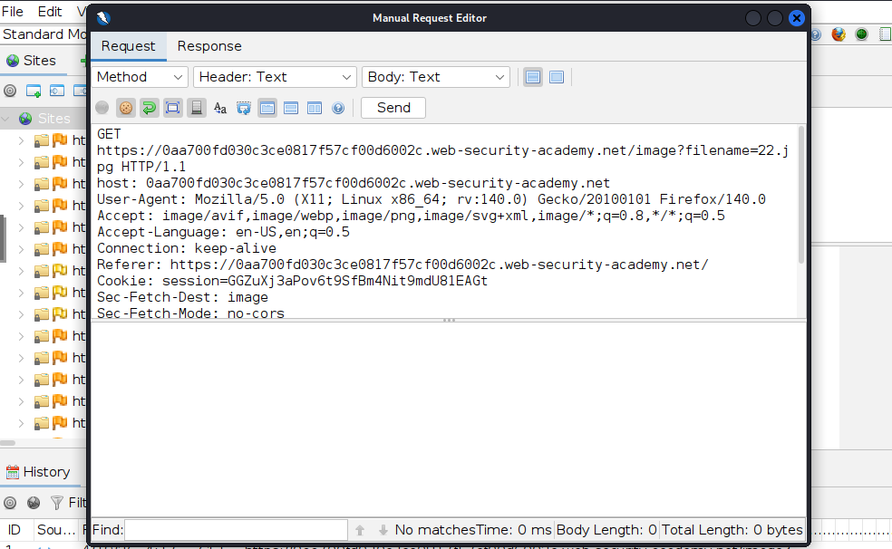

Tässä korvaamme kuvan /passwrd:illa jotta saamme vastauksena tuon kyseisen tiedoston

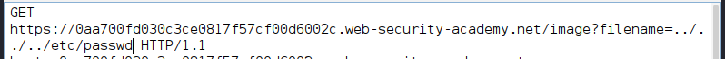

Muutamme vielä Body: Text eikä image, ja tiedoston sisältö pitäisi näkyä.

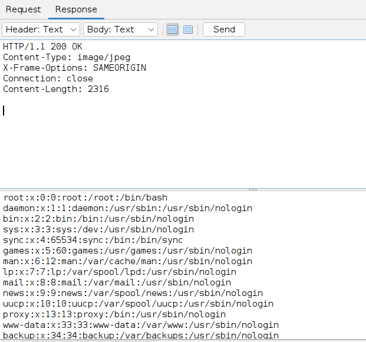

Palvelin ilmoittaa että sisällön tyyppi on kuva, mutta se silti hakee normaalin tiedoston levyltä ja lähettää sen sisällön sellaisenaan. Valitettavasti tiedosto sisältää arkaluontosta dataa joka on nyt suoraan hyökkääjän luettavissa puuttuvien suojamekanismien takia.

## g) File path traversal, traversal sequences blocked with absolute path bypass

Tässä teemme saman kuin aikaisemmassa tehtävässä, mutta nyt käytämme absoluuttista polkua. Eli selaamme sivua, valitsemme meille jonkun palautuksen josta löytyy kuva ja muutamme sitä lisämällä tällä kertaa /etc/passwd.

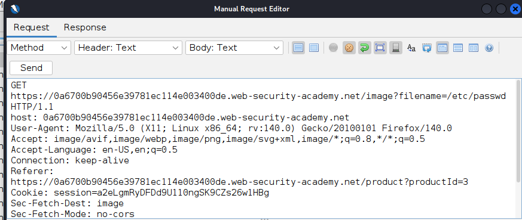

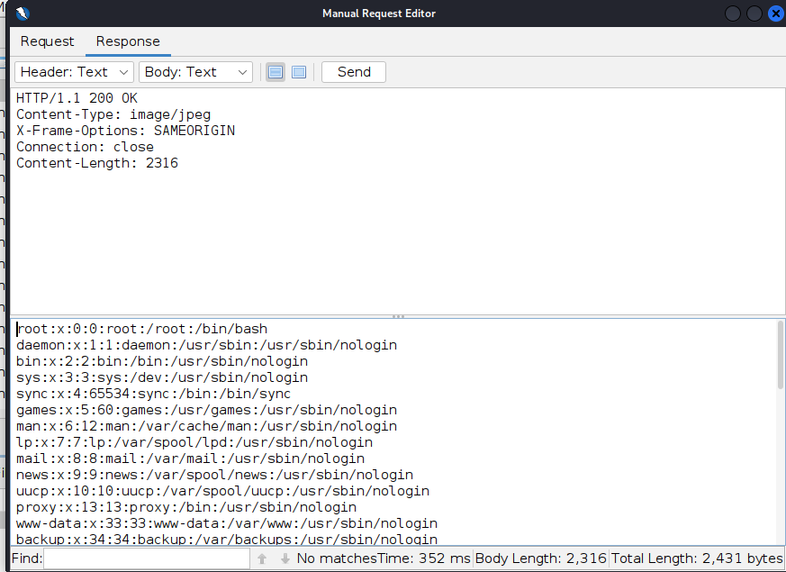

Palvelin tällä kertaa estää /../ nimessä joten käytämme absoluuttista polkua ja tämä menee silti läpi. Jos palvelimella on liian löyhä suodatin joka yrittää vain löytää /../ ja estää sen. Suodatin ei aktivoidu, jos haemme polun suoraan.

## h) File path traversal, traversal sequences stripped non-recursively

Tässä taas on käytetty myös suodatinta joka automaattisesti poistaa merkkijonot jotka ovat kielletty, tässä tapakusessa siis ../ ja voimme kiertää tämän tuplaamalla pisteet ja /, esim. filename=....//....//....//etc/passwd


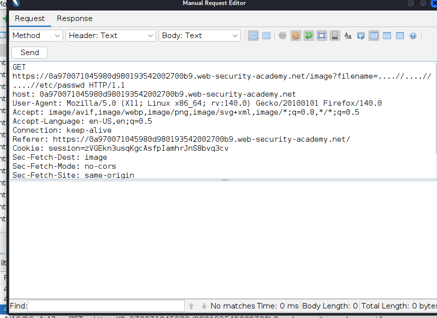

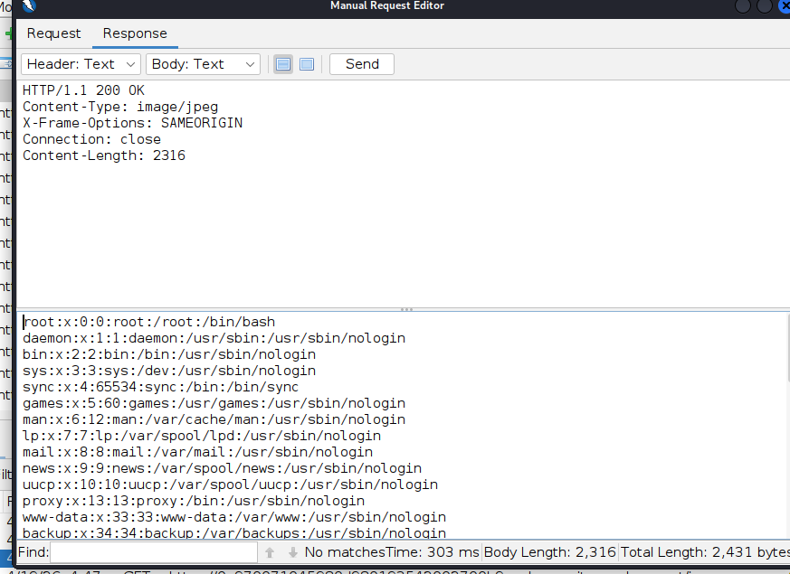

Suodatin on laiska ja poistaa juuri ../ merkkijonon ja jättää muut, mutta koska tuplasimme kaiken, niin se oikeasti suodattaa siitä taas toimivan polun joka taas palauttaa meille passwds tiedoston sisällön.

## i) Insecure Direct Object Reference (IDOR)

Tässä tehtävässä ensin avasin chatin ja kirjotin henkilölle Hal Pline. Latasin transcriptin koneelleni ja tiedoston nimi oli 2.txt. Seuraavaksi muokkasin get pyyntöä ja muutin tiedoston nimen 1.txt.

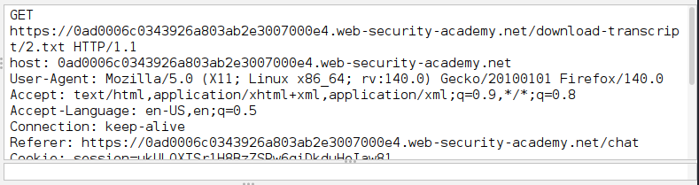

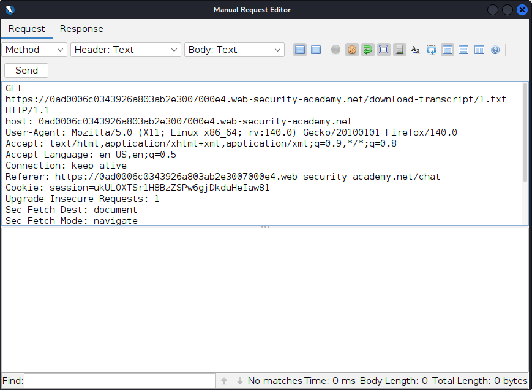

Tämä palautti minulle jonkun muun henkilön keskustelun jossa hän mainitsee salasanansa.

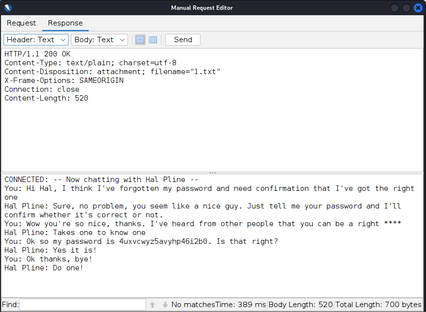

Tässä ongelma on puuttuva tarkastus, onko kullakin käyttäjällä oikeudet avata tai muuten selata tiedostoja, jotka eivät periaatteessa kuulu heille. Palvelin tarkastaa olenko kirjautunut sisään, mutta ei tarkasta millä käyttäjällä. Palvelin siis palauttaa minulle tosien käyttäjän tietoja, koska minkäänlaista tarkastusta kenelle tiedosto kuuluu tai ketä sitä saa käyttää ei ole.
