# h5 Fuzzy

[Tehtävänanto](https://terokarvinen.com/tunkeutumistestaus/#h5-fuzzy)

## x) Tiivistä

### [Tero Karvinen: Find Hidden Web Directories - Fuzz URLs with ffuf](https://terokarvinen.com/2023/fuzz-urls-find-hidden-directories/)

- fuff on nopea web fuzzeri jota käytetään verkkopalvelimien piilotettujen hakemistojen etsimiseen
- fuff kokeilee nopeasti tuhansia mahdollisia polkuja, jotka ovat määritelty sanalistoissa
- Sisältää suodatustoiminnon, jolla voi suodattaa pyynnöt esimerkiksi koon mukaan
- Tärkeintä on laillinen lupa, jos haluaa testata työkalua oikeisiin kohteisiin

### [ffuf: Fuzz Faster U Fool README.md](https://github.com/ffuf/ffuf/blob/master/README.md)

- FUZZ on avainsana, jonka voi upottaa minne tahansa urliin ja ohjelma myöhemmin korvaa sen sanalistan sanoilla
- Lukuisia flageja, joiden avulla voi etsiä vain tiettyjä tilakoodeja tai suodattaa roskavastaukset kokonaan pois
- Painamalla ENTER nappia skannauksen aikana, voi keskeyttää toiminnon ja muokata suodattimia lennosta

## a) Fuzzzz. Ratkaise dirfuz-1 artikkelista Karvinen 2023: Find Hidden Web Directories - Fuzz URLs with ffuf.

Asensin dirfuzt-0 maalikoneen ja fuffin ja latasin Seclistin.

Ajamalla kommennon ```ffuf -w common.txt -u http://127.0.0.2:8000/FUZZ``` ohjelma menee läpi common.txt, eli meidän SecListin, läpi ja testaa kaikki pääteet läpi. 

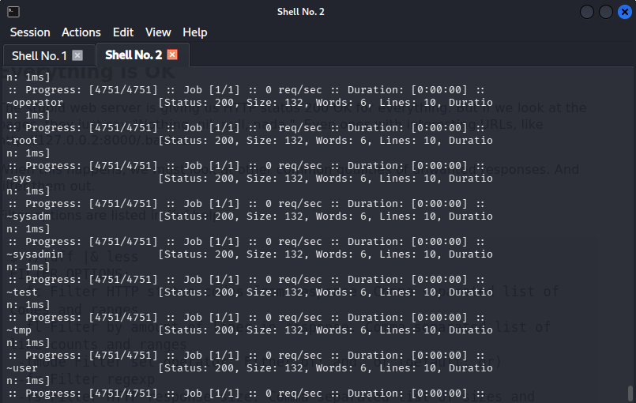

Voimme suodattaa koon perusteella, jotta fuff jättää huomioimatta kaikki vastaukset, joiden koko on esim 132 käyttämällä komentoa ```ffuf -w common.txt -u http://127.0.0.2:8000/FUZZ -fs 132```


Suodattamisen jälkeen löytyi kiinnostava kansio nimeltä admin statuskoodilla 200. Tämä ei jäänyt suodattimeen, koska koko on 160.

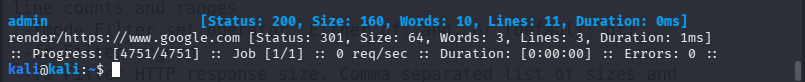

Sammutin dirfuzt-0 maalin ja käynnistin dirfuzt-1 maalin, jossa tehtävänä oli löytää adminsivu ja versionhallinta. Ajoin samat komennot. Tutkiskelin kokoja ja päätin käyttää kokoa 154 ja suodatin tämän mukaan. Täältähän ne tarvittavat flagit löytyi.

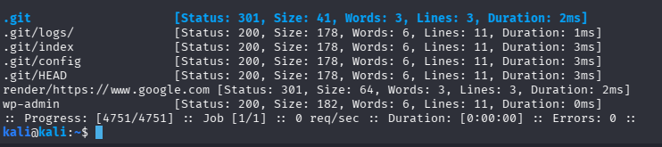

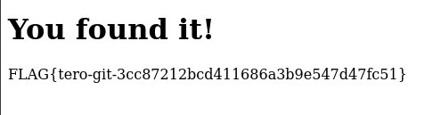

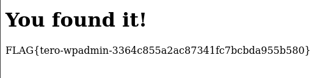

## b) Fuff me

Asensin fuffin ja FuffMe harjoitusmaalin Kaliin, ja se onnistui samoilla ohjeilla kun debianiin, eli

```
sudo apt-get update
sudo apt-get install docker.io git ffuf

```

Maalikoneen docker kontti

```
git clone https://github.com/adamtlangley/ffufme
cd ffufme/
sudo docker build -t ffufme .
```
Ja itse maalikoneen käynnistys

```
sudo docker run -d -p 80:80 ffufme

```

ladataan wordlistit jota tulemme käyttämään

```
mkdir $HOME/wordlists
cd $HOME/wordlists
wget http://ffuf.me/wordlist/common.txt
wget http://ffuf.me/wordlist/parameters.txt 
wget http://ffuf.me/wordlist/subdomains.txt
```

Tämän jälkeen voi selaimen kautta testata että se on pystyssä, tai sitten curl komennolla.

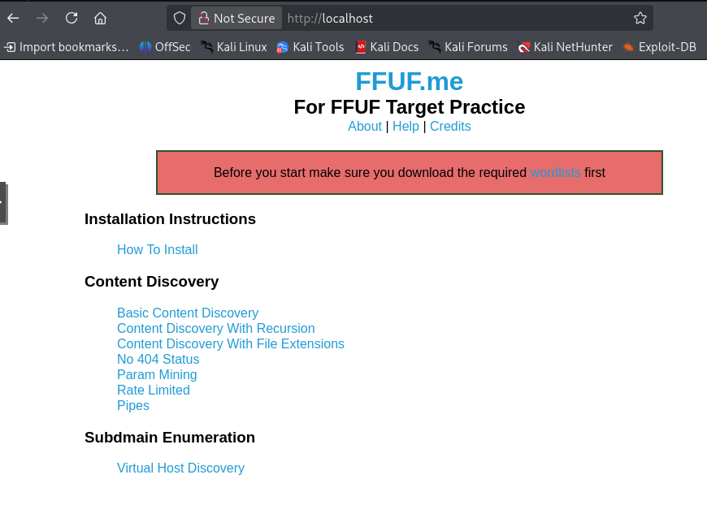

Jos sivu toimii, voimme aloittaa itse tehtävient teon

## c) Basic Content Discovery

Tässä harjoitellaan piilotettujen kansioiden ja tiedostojen löytämistä palvelimelta

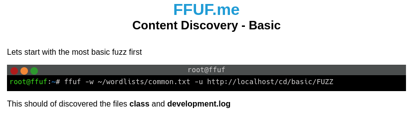

Ajoin annetun komennon kali koneellani ja löyty kaksi polkua

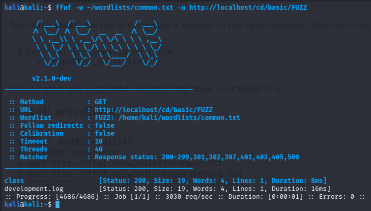

Avasin toisen niistä selaimella ja maalikone ilmoitti että löysin oikean tiedoston.

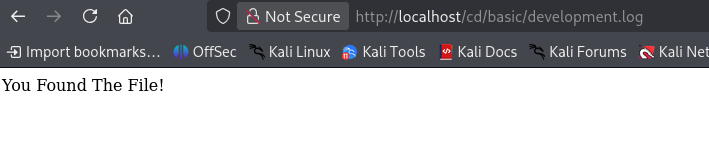

## d) Content Discovery With Recursion

Kun työkalu löytää uuden kansion, se ei pysähdy siihen, vaan alkaa automaattisesti ajaa samaa sanalistaa läpi uusien kansioiden sisällä

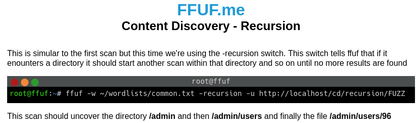

Tässä komento meni rekursiivisesti läpi polut jotka löytyi.

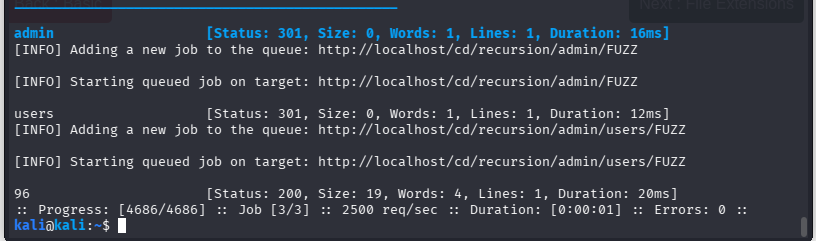

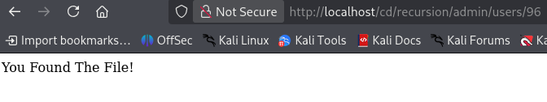

## e) Content Discovery With File Extensions

Tässä hakua tarkennetaan etsimään tiettyjä tiedostotyyppejä

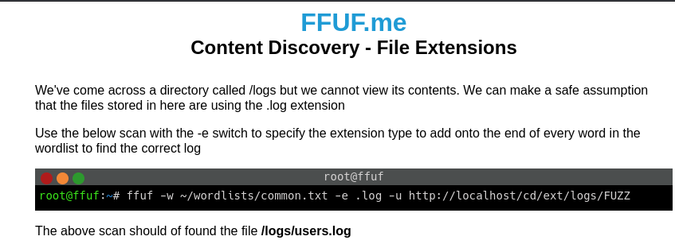

Tässä etsimme tiedostonpäättena avulla, joka on tässä .log

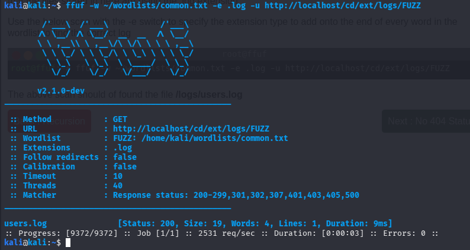

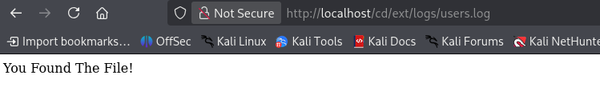

## f) No 404 Status

Tässä tehtävässä suodatetaan pois ei toivotut vastaukset

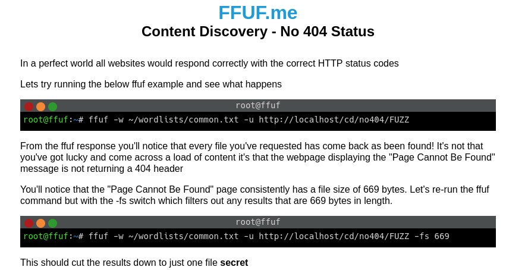

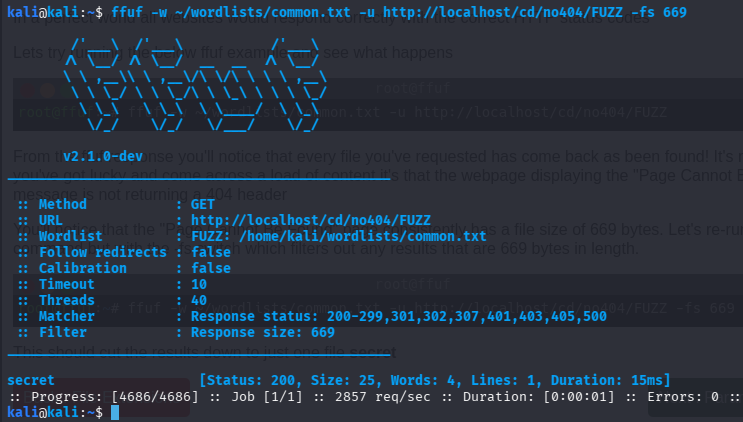

Tässä muut palauttavat 404, paitsi tämä /secret

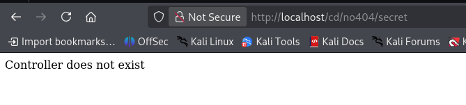

## g) Param Mining

Tässä etsitään verkkosivun osoitteeseen piilotettuja parametreja

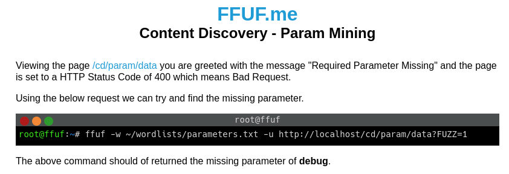

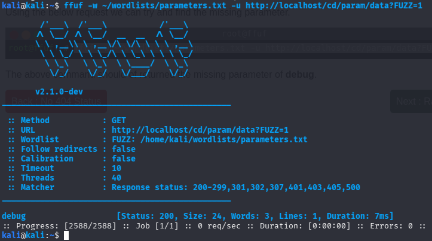

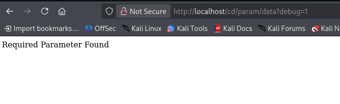

## h) Rate Limited

Tässä tehtävässä hidastetaan pyyntöjä, jotta yhteyttä ei estetä liian nopeiden yrityksien takia

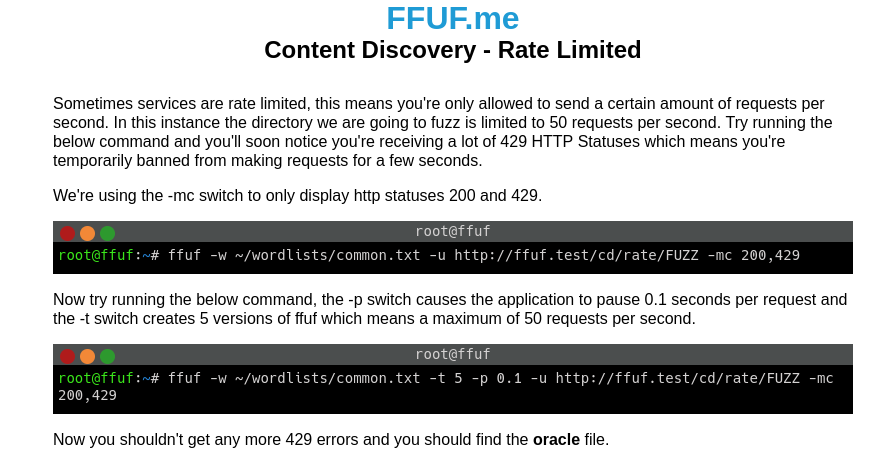

Tässä jos ajaa ekaa komentoa, tulee rate limit vastaan, joten käsketään ohjelman odottaa 

Tässä yritin eri keinoja saada tätä löytämään tuon oracle tiedoston, mutta ei vain millään onnistunut. 

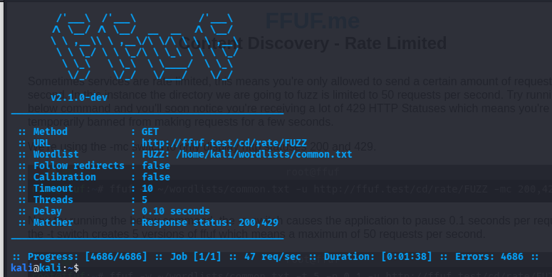


## i) Subdomains - Virtual Host Enumeration

Tässä pyritään löytämään palvelimelta piilotettuja ympäristöjä

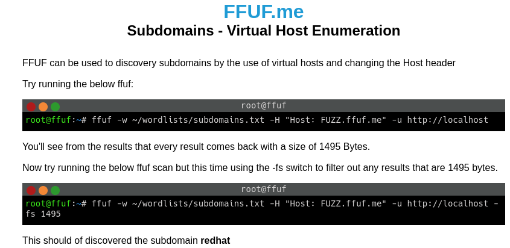

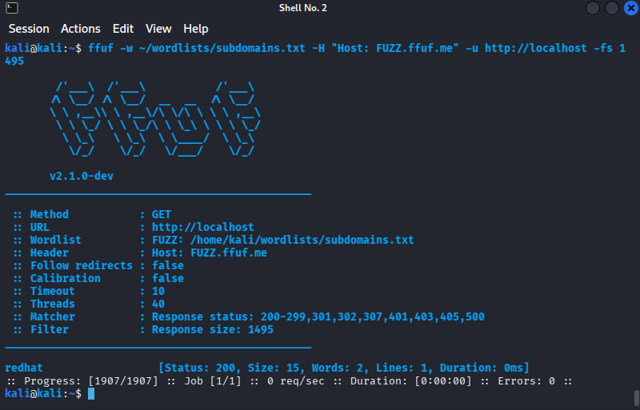

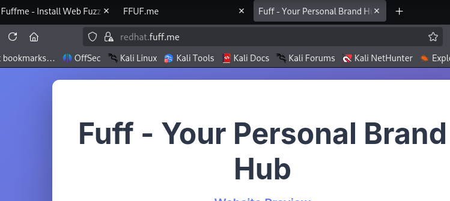


## Lähteet

Tero Karvinen: Tunkeutumistestaus – https://terokarvinen.com/tunkeutumistestaus/#h5-fuzzy

ffuf: Fuzz Faster U Fool – https://github.com/ffuf/ffuf/blob/master/README.md

Tero Karvinen: Find Hidden Web Directories - Fuzz URLs with ffuf – https://terokarvinen.com/2023/fuzz-urls-find-hidden-directories/
