## x) Tiivistelmät

### Cracking Passwords with Hashcat

- Järjestelmät eivät tallenna salasanoja cleartextinä, vaan tiivisteinä (hash)
- Käyttää valmiita sanalistoja kuten rockyou.txt, jossa noin 14 miljoonaa sanaa
- Hyödyntää prosessorin ja näytönohjaimen laskentatehoa 
- Käyttö vain omilla tiedostoilla tai luvallisissa testeissä

### Crack File Password With John

- Tukee monia tiedostomuotoja kuten zip, pdf
- Pitää itse compilea lähteestä
- Kaksivaiheista, ensin selvitetään hash ja sen jälkeen murretaan se
- hyökkää hashiin käyttämällä sanalistoja tai sääntöjä (best64 esim.)

## a) Asenna Hashcat ja testaa sen toiminta murtamalla esimerkkisalasana

Asennetaan hashcat ja muut ohjelmat mitä tulemme tehtävissä tarvitsemaan komennolla

```sudo apt-get update && sudo apt-get install -y hashcat hashid wget```

Ladataan ```rockyou.txt``` word list ja puretaan se työkansioon

```
wget https://github.com/danielmiessler/SecLists/raw/master/Passwords/Leaked-Databases/rockyou.txt.tar.gz
tar xf rockyou.txt.tar.gz
rm rockyou.txt.tar.gz

``` 
avataan tiedosto ja tutkitaan sisältöä


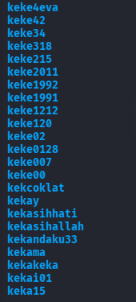


Tiedosto on täynnä sanoja ja salasanoja

Jotta voimme murtaa esimerkkisalasana, täytyy ensiksi luoda sellainen hashattuna. Käytetään esimerkkisalasanana ´´´hunter2´´´.

Luomme md5 hashin komennolla

```echo -n "hunter2" | md5sum```


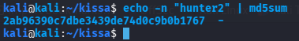

Nyt voimme käyttää hashcatia ja rockme.txt listaa salasanan murtamiseen komennolla

```hashcat -m 0 -a 0 korkkaus.txt rockyou.txt```

korkkaus.txt sisältää meidän hashin josta yritetään rockme.txt avulla saada plaintext salasana.

Tässä kohtaa kohtasin ongelman. Kalissa hashcat ei halunnut toimia vaan herjasi kokoajan että "compatible platform not found".

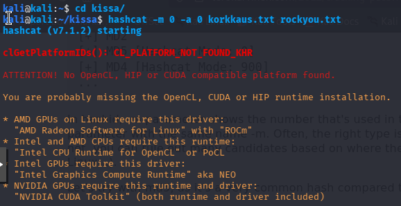

Taistelin jonkun aikaa tämän ongelman kanssa ja päätin vaihtaa konetta ja hoitaa tehtävät Nobara linuxilla. Tein samat jutut tälläkin koneella mitä edellisellä ongelmaan asti ja kun pääsin ongelmakohtaan testasin ajaa komennon uudelleen. Tällä kertaa hashcat onnistui purkamaan hashin oikeaksi salasanaksi, joka oli "hunter2"

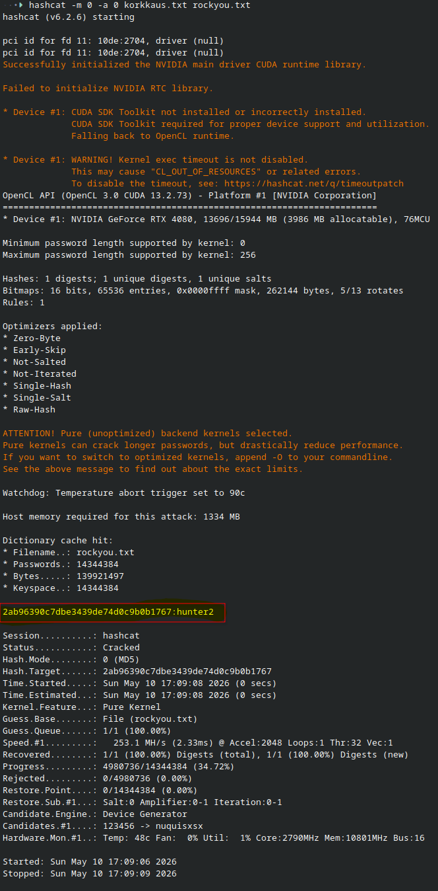

## c) John the ripperin asennus

Asensin ensin John the Ripperin flatpakkina. Ei oikeen halunnut toimia joten asensin sitten sen vain komennolla ´´´sudo dnf install john´´´

Tämän jälkeen latasin tero.zip tiedoston komennolla

```wget https://TeroKarvinen.com/2023/crack-file-password-with-john/tero.zip```

komennolla ```./john/john/run/zip2john tero.zip > tero.hash``` loin ensin hash tiedoston

jonka jälkeen käytin john the ripperiä komennolla ```./john/john/run/john tero.hash```

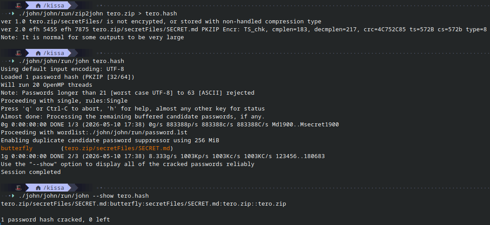

## e) Tiedoston salaus ja purku

Tehdään salattu pdf tiedosto. Käytin tähän qpdf ohjelmaa. Laitoin salasanaksi ensin salasana123 ja lähdin purkamaan sitä.

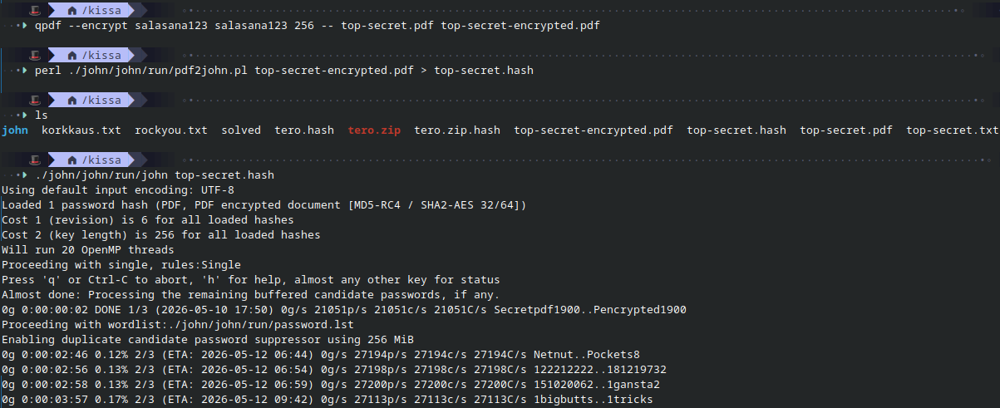

 Se näytti yli 2 päivää kestoksi, joten vaihdoin salasanan helpommaksi ja salasana löytyi melkein heti.

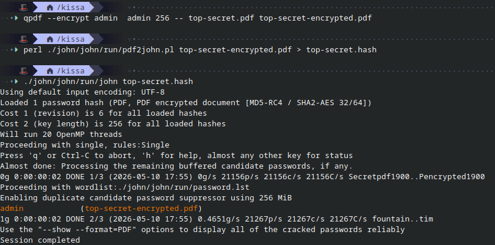

## f) Tiiviste

Loin ensin tiivisteen käyttämällä komentoa

```mkpasswd -m sha-512 submarine > linux-password.hash```

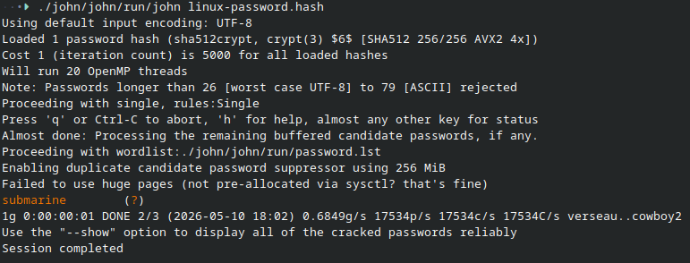

Tämä meni tosi nopeasti, sekunnissa valmis. Testasin myös nyt muuttamalla salasanan "submarine123" ja ajoin testin uudestaan. Tämä näytti jo olevan pitkäkestoisempi juttu, taas noin kaksi päivää. Huomaa siis että numeroiden käyttö lisää purkamisen työtaakkaa.

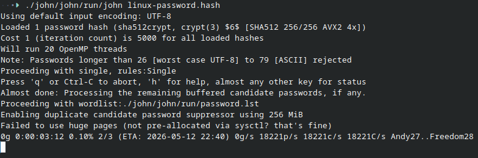

## g) sanakirja

Tein oman sanakirjan kopioimalla suomen sanalistan sanat tekstitiedostoon. (https://kaino.kotus.fi/lataa/nykysuomensanalista2024.txt).

```wget https://kaino.kotus.fi/lataa/nykysuomensanalista2024.txt -O sanalista.txt```

puhdistin tiedoston vielä kerran komennolla

``` grep -oE '\w+' sanalista.txt | sort -u > puhdistettu-sanalista.txt```


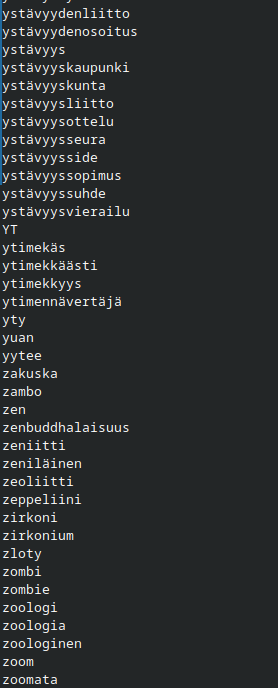

sanalista on valmis käytettäväksi.

## h) Hash rules

Voimme tässä käyttää meidän puhdistettua sanalistaa jonka teimme joka sisältää suomenkielisiä sanoja, mutta kaikki pienellä ja ei numeroita. Teemme oman säännön joka testaa sanalistan jokaista sanaa ja lisää myös huutomerkin (!) loppuun.

Luodaan tätä varten uusi "apina.hash" tiedosto ja asetetaan salasanaksi "apina!"

```mkpasswd -m sha-512 apina! > apina.hash```

Tehdään uusi sääntö

```echo '$!' > huutomerkki.rule``` komennolla. Tämä sääntö yksinkertaisesti lisää huutomerkin sanojen perään.

ja käytetään sanalistaa hashcatilla salasanan selvittämiseksi

```hashcat -m 1800 apina.hash puhdistettu-sanalista.txt -r huutomerkki.rule -O```

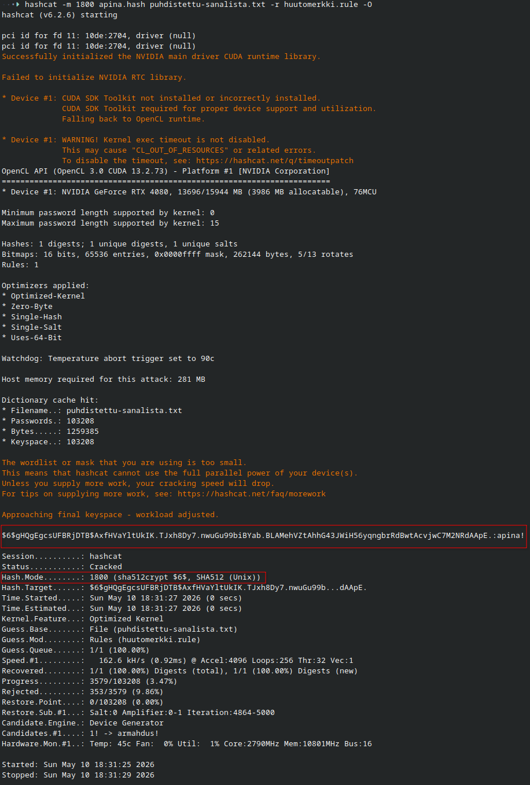


## i) lippuvalmistelu

Kaikki on valmista tätä varten. Kali VM asennettuna Fedora 43 läppäriin.

## Lähteet

Cracking Passwords with Hashcat: https://terokarvinen.com/2022/cracking-passwords-with-hashcat/

Crack File Password With John: https://terokarvinen.com/2023/crack-file-password-with-john/

Nykysuomen sanalista (Kotus): https://kaino.kotus.fi/lataa/nykysuomensanalista2024.txt

qpdf: A content-preserving PDF document transformer: https://qpdf.sourceforge.io/

Tunkeutumistestaus - h7 toukokuu 2026!: https://terokarvinen.com/tunkeutumistestaus/#h7-toukokuu2026
